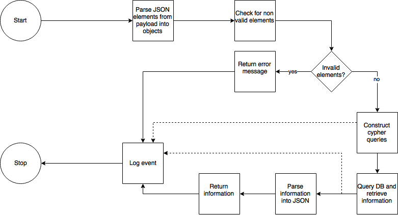

Java Client Flow Chart
===================
Overview
^^^^^^^^

The flow chart shows the process of parsing and processing the queries.
Query elements that pass the validation are documented on the following page: :ref:`node_and_edge_classe`.

   Java client overview

