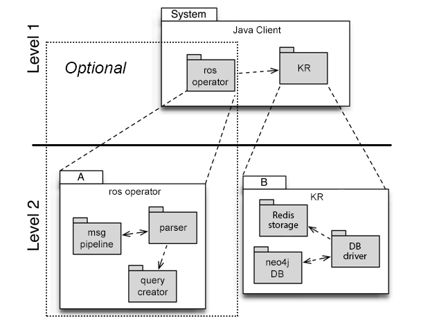

Building Block View
===================
Overview
^^^^^^^^

.. _bb-l1-overview:

The white box view of the first level of the code.
This is a white box view of the system as shown within the in Context in figure: :ref:`context_within_environment`.
External libraries and software are clearly marked.

.. _building-block-overview:

   Building blocks overview

.. _bb-l1-component-list:

